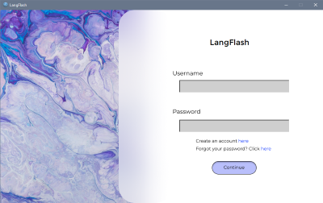
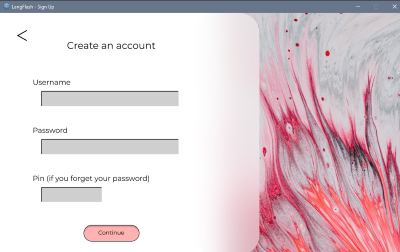
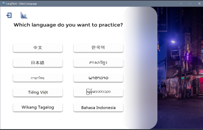
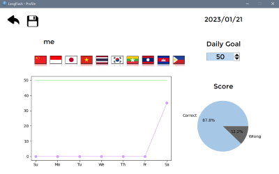
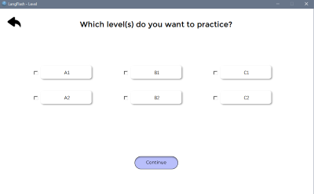
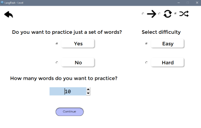
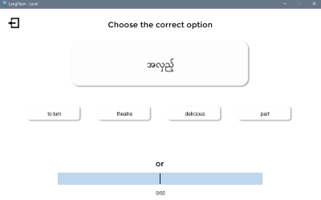

# LangFlash

__LangFlash__ is a program for studying vocabulary of the east and south east asian languages.
 
Supported languages:

  * Chinese
  * Japanese
  * Korean
  * Burmese 
  * Indonesian
  * Thai
  * Lao
  * Khmer
  * Vietnamese
  * Tagalog

It consists in a flashcard game were there are 2 difficulties, easy and hard. For the easy version, you have 4 options of answer while in hard you have 8 options.

Difficulties:

* Normal	- four tentative answers are displayed
* Hard	- eight tentative answers are displayed

> NOTE: The user can always type the answer directly instead of choosing between the options. 

The languages sets of vocabulary are made of:

* Chinese	: +11 000 words
* Japanese	: 6 000 words
*	Korean 	: +5 500 words
*	Others	: +5 200 words

Only for *Chinese* and *Japanese* it is included the division between certification levels, that means that the vocabulary is sorted by **HSK** 1-9 for chinese and the **JLPT** N 5-1 for japanese. 

> NOTE: The rest of the languages are divided based on the english words from the european certification levels.

Except from chinese, no other language includes an special option for displaying the phonetic system like 拼音. For Japanese, it displays kanji.

The user can check his statistics of his study frequency for language and his cumulative accuracy of all languages, also the languages that have been practiced at least once and there is a counter of the daily goal for the user.

In → you will be given a word, and you have to type or choose it in the language chosen, with ↻ it will be the opposite, you will be displayed the word in that language and you have to answer it in english, and the ⇄ shuffle option will be the mixture of that game.

---
### Disclaimer

Some translations may be innacurate due to the differences between nouns, verbs, adjectives, etc.

---

### Requirements

* random
* tkinter
* matplotlib
* numpy
* pandas
* datetime
* Montserrat font

---
## Example

> Run `log_in.py` and start using it.

